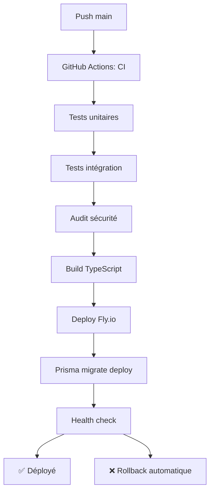

# Protocole de Déploiement - Backend MapQuiz

## 🎯 **Vue d'Ensemble**

Ce document décrit le protocole de déploiement continu pour le backend MapQuiz (API Fastify/Node.js), hébergé sur Fly.io avec base de données PostgreSQL.

## 🏗️ **Architecture de Déploiement**

### **Composants Backend**
- **Application** : `backend-solitary-moon-1875.fly.dev`
- **Base de données** : PostgreSQL (Fly.io Postgres)
- **Runtime** : Node.js 22 dans conteneur Docker
- **Plateforme** : Fly.io avec déploiement automatisé

### **Environnements**
- **Production** : Branche `main` → Déploiement automatique
- **Développement** : Branche `develop` → Tests automatiques
- **Feature** : Branches de fonctionnalités → Tests PR

## 🔄 **Séquence de Déploiement Production**

**Déclenchement** : Push sur `main`



### **Étapes Détaillées**

1. **Tests Automatiques** (5-8 minutes)
   - Tests unitaires avec couverture > 80%
   - Tests d'intégration avec PostgreSQL
   - Tests de performance
   - Audit de sécurité npm

2. **Build & Validation** (2-3 minutes)
   - Compilation TypeScript
   - Génération client Prisma
   - Validation des types
   - Création des artifacts

3. **Déploiement** (3-5 minutes)
   - Build Docker sur Fly.io
   - Déploiement sans interruption
   - Application des migrations DB
   - Health check automatique

## ⚙️ **Configuration Requise**

### **Variables d'Environnement Production**
```env
# Base de données
DATABASE_URL=postgresql://...fly.dev:5432/...

# Authentication
BETTER_AUTH_SECRET=<secret-64-chars>
BETTER_AUTH_URL=https://backend-solitary-moon-1875.fly.dev
GOOGLE_CLIENT_ID=<google-oauth-client-id>
GOOGLE_CLIENT_SECRET=<google-oauth-secret>

# Application
SERVER_URL=https://backend-solitary-moon-1875.fly.dev
NODE_ENV=production
PORT=3000

# GitHub Integration
GITHUB_TOKEN=<github-personal-token>
GITHUB_REPO_OWNER=<your-username>
GITHUB_REPO_NAME=<backend-repo-name>
```

### **Secrets GitHub Actions**
- `FLY_API_TOKEN` - Token API Fly.io
- `TEST_DB_PASSWORD` - Mot de passe DB test
- `TEST_AUTH_SECRET` - Secret auth pour tests
- `TEST_GOOGLE_CLIENT_ID` - Client Google pour tests
- `TEST_GOOGLE_CLIENT_SECRET` - Secret Google pour tests

## 🧪 **Gates de Qualité**

### **Critères Obligatoires**
- ✅ **Couverture tests** : > 80%
- ✅ **Audit sécurité** : 0 vulnérabilité critique
- ✅ **Build TypeScript** : 0 erreur
- ✅ **Tests performance** : Réussis
- ✅ **Linting** : 0 erreur ESLint

### **Seuils de Performance**
- ⏱️ **Build time** : < 5 minutes
- ⏱️ **Deploy time** : < 3 minutes
- 🔍 **Health check** : Réponse < 30 secondes
- 📊 **Memory usage** : < 512MB

## 🚀 **Déploiement Manuel**

### **Prérequis**
```bash
# Installation Fly CLI
curl -L https://fly.io/install.sh | sh

# Authentification
fly auth login
```

### **Commandes de Déploiement**
```bash
# Déploiement standard
fly deploy --remote-only

# Déploiement avec logs
fly deploy --remote-only --verbose

# Déploiement sans migrations (si problème)
fly deploy --remote-only --no-release-command
```

## 🚨 **Procédures d'Urgence**

### **Rollback Automatique**
En cas d'échec du health check, le déploiement est automatiquement annulé.

### **Rollback Manuel**
```bash
# Lister les releases
fly releases

# Rollback vers version précédente
fly releases rollback [VERSION]

# Rollback d'urgence (dernière version stable)
fly releases rollback --force
```

### **Debug Production**
```bash
# Logs en temps réel
fly logs --tail

# Logs avec filtres
fly logs --tail --region cdg

# SSH dans l'instance
fly ssh console

# Redémarrage d'urgence
fly restart

# Status détaillé
fly status --all
```

## 📋 **Checklist Pré-Déploiement**

### **Développeur**
- [ ] Tests locaux passent (`npm run test`)
- [ ] Branch à jour avec main
- [ ] Migration DB testée localement
- [ ] Variables d'environnement vérifiées
- [ ] Documentation mise à jour

### **CI/CD Automatique**
- [ ] Tous les tests passent
- [ ] Build réussi sans erreur
- [ ] Audit sécurité OK
- [ ] Coverage > 80%
- [ ] Performance tests OK

## 📋 **Checklist Post-Déploiement**

- [ ] API accessible (`curl https://backend-solitary-moon-1875.fly.dev/health`)
- [ ] Endpoints principaux répondent
- [ ] WebSockets fonctionnels
- [ ] Base de données accessible
- [ ] Logs propres (pas d'erreurs)
- [ ] Métriques normales

## 🔧 **Outils et Composants**

### **Pipeline CI/CD**
- **GitHub Actions** : Orchestration des tests et déploiements
- **Fly.io** : Plateforme de déploiement et hébergement
- **Docker** : Conteneurisation de l'application

### **Compilateur & Build**
- **TypeScript** : Transpilation et vérification de types
- **tsx** : Runtime de développement
- **Prisma** : Génération du client et migrations

### **Base de Données**
- **PostgreSQL** : Base de données principale
- **Prisma Migrate** : Gestion des migrations
- **Connection pooling** : Optimisation des connexions

### **Monitoring**
- **Health endpoint** : `/health` avec status DB
- **Fly.io metrics** : Monitoring intégré
- **Application logs** : Via Fastify logger

## 📊 **Métriques de Performance**

### **Objectifs Production**
- **Temps de réponse API** : < 200ms (P95)
- **Disponibilité** : > 99.9%
- **Temps de démarrage** : < 30 secondes
- **Memory usage** : < 512MB stable

### **Surveillance Continue**
- Health checks automatiques toutes les minutes
- Alertes automatiques en cas de problème
- Logs centralisés avec recherche

## 🚀 **Améliorations Futures**

### **Environnements Additionnels**
- **Staging** : Environnement de pré-production
- **Preview** : Environnements éphémères pour PR

### **Monitoring Avancé**
- **APM Integration** : Sentry, DataDog, ou New Relic
- **Métriques custom** : Business metrics
- **Alerting** : Notifications Slack/Email

### **Performance**
- **CDN** : Cache des assets statiques
- **Database scaling** : Réplicas en lecture
- **Caching** : Redis pour sessions/cache

---

**Dernière mise à jour** : Janvier 2025  
**Responsable** : Équipe Backend MapQuiz  
**Statut** : En production

## 🔗 **Liens Utiles**

- [Guide de développement](./DEVELOPPEMENT.md)
- [Configuration Fly.io](./fly.toml)
- [Schema Prisma](./prisma/schema.prisma)
- [Dashboard Fly.io](https://fly.io/dashboard)
